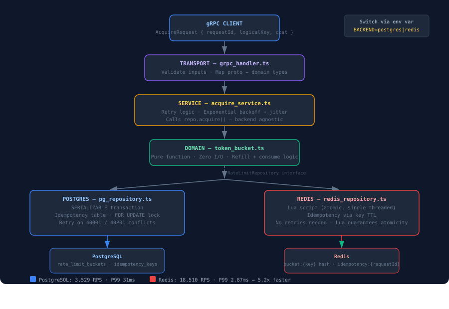

# Distributed Rate Limiter

A production-grade distributed rate limiter using the **Token Bucket** algorithm, exposed via **gRPC**, with support for two pluggable backends — **PostgreSQL** (durable, ACID) and **Redis** (in-memory, high-throughput).

Built with TypeScript and Bun.

---

## Architecture



### Layer Breakdown

| Layer | File | Responsibility |
|---|---|---|
| Transport | `grpc_handler.ts` | Receives gRPC calls, validates inputs, maps responses |
| Service | `acquire_service.ts` | Orchestrates acquire flow, handles retries with backoff |
| Domain | `token_bucket.ts` | Pure token bucket algorithm — no I/O, fully testable |
| Persistence | `pg_repository.ts` / `redis_repository.ts` | Backend-specific atomicity |

### Design Decisions

**Why Token Bucket?**

Token bucket allows burst traffic up to the bucket capacity, then smoothly limits to the refill rate. Unlike fixed window (which can allow 2x traffic at window boundaries) or sliding window (expensive to compute), token bucket gives natural, tunable behavior with a simple state model — just `tokens` and `last_refill_at`.

**Why PostgreSQL uses SERIALIZABLE isolation?**

With READ COMMITTED, two concurrent requests can both read the same stale token count, both decide they have enough, and both commit — consuming more tokens than actually existed. SERIALIZABLE forces PostgreSQL to detect this conflict and abort one transaction, which then retries.


**Why Idempotency?**

Network failures cause clients to retry. Without idempotency, a retry after a successful-but-timed-out request would consume tokens twice. Each request carries a `requestId` (UUID). The first call saves the result; replays return the cached result without touching the bucket.

---

## Performance

Benchmarked locally with Bun on the same machine for both backends.

### Scenario 1 — Low Contention (1000 requests, 20 concurrent workers, unique keys)

| Backend | Throughput | P50 | P95 | P99 |
|---|---|---|---|---|
| PostgreSQL | 3,529 RPS | 3.45ms | 15.47ms | 31.54ms |
| Redis | 18,510 RPS | 0.95ms | 2.59ms | 2.87ms |
| **Improvement** | **5.2x** | **3.6x** | **6.0x** | **11.0x** |

### Scenario 2 — High Contention (200 requests, 10 concurrent workers, same key)

| Backend | Throughput | P50 | P95 | P99 |
|---|---|---|---|---|
| PostgreSQL | 1,256 RPS | 0.68ms | 39.84ms | 40.75ms |
| Redis | 10,715 RPS | 0.71ms | 3.91ms | 4.11ms |
| **Improvement** | **8.5x** | **~same** | **10.2x** | **9.9x** |

**Key insight:** Redis P99 stays flat (2.87ms → 4.11ms) when contention increases. PostgreSQL P99 spikes (31.54ms → 40.75ms) because serialization conflicts force retries. For shared hot-key scenarios, Redis is the clear choice.

### When to Choose Each Backend

| | PostgreSQL | Redis |
|---|---|---|
| Durability | ✓ Survives restarts | X In-memory (persistence optional) |
| Audit log | ✓ Full history in idempotency_keys | X TTL-based, expires |
| Throughput | ~3,500 RPS | ~18,500 RPS |
| Tail latency under contention | Degrades (retries) | Stays flat (Lua atomic) |
| Best for | Billing / quota enforcement | API rate limiting |

---

## Quick Start

### Prerequisites

- Docker and Docker Compose
- Bun (for running benchmarks and tests)

### Run with PostgreSQL (default)

```bash
docker compose up
```

### Run with Redis

```bash
BACKEND=redis docker compose up
```

Both backends start regardless — the app connects to whichever `BACKEND` specifies.

---

## API

Defined in `src/proto/ratelimit.proto`.

```protobuf
service RateLimiter {
  rpc Acquire(AcquireRequest) returns (AcquireResponse)
}
```

### AcquireRequest

| Field | Type | Description |
|---|---|---|
| `logical_key` | string | Resource identifier e.g. `user:123`, `api:payments` |
| `cost` | uint32 | Tokens to consume. Must be > 0 |
| `request_id` | string | Client-generated UUIDv4 for idempotency. Required |

### AcquireResponse

| Field | Type | Description |
|---|---|---|
| `verdict` | enum | `ALLOWED` or `DENIED` |
| `remaining` | double | Token balance after this request |
| `retry_after` | Duration | How long to wait if DENIED. Zero if ALLOWED |

### Example

```typescript
const response = await client.acquire({
  requestId: crypto.randomUUID(),
  logicalKey: 'user:123',
  cost: 3
});

if (response.verdict === 'ALLOWED') {
  // proceed — 3 tokens consumed
} else {
  // back off for response.retryAfter seconds
}
```

---

## Configuration

All configuration via environment variables.

| Variable | Default | Description |
|---|---|---|
| `BACKEND` | `postgres` | `postgres` or `redis` |
| `DATABASE_URL` | — | Required when `BACKEND=postgres` |
| `REDIS_URL` | — | Required when `BACKEND=redis` |
| `DEFAULT_CAPACITY` | `10` | Max tokens per bucket |
| `DEFAULT_REFILL_RATE` | `1` | Tokens refilled per second |
| `MAX_RETRIES` | `3` | Max retries on serialization failure (Postgres only) |
| `BASE_BACKOFF_MS` | `50` | Base retry backoff in ms |
| `MAX_BACKOFF_MS` | `500` | Max retry backoff cap in ms |
| `BIND_ADDR` | `0.0.0.0:50051` | gRPC server bind address |

---

## Data Model

### PostgreSQL

```sql
rate_limit_buckets
  key             TEXT PRIMARY KEY   -- logical key e.g. "user:123"
  tokens          DOUBLE PRECISION   -- current token count
  last_refill_at  TIMESTAMPTZ        -- last time tokens were refilled
  capacity        DOUBLE PRECISION   -- max tokens
  refill_rate     DOUBLE PRECISION   -- tokens per second

idempotency_keys
  request_id      UUID PRIMARY KEY   -- client-generated UUID
  bucket_key      TEXT               -- which bucket this was for
  result_status   TEXT               -- ALLOWED or DENIED
  tokens_remaining DOUBLE PRECISION
  wait_time_ms    BIGINT
  created_at      TIMESTAMPTZ
```

### Redis

```
bucket:{logicalKey}       → Hash { tokens, last_refill_at, capacity, refill_rate }  TTL: 60s
idempotency:{requestId}   → Hash { status, tokens_remaining, wait_time_ms }          TTL: 60s
```

---

## Testing

```bash
# Unit tests (token bucket algorithm — no infrastructure needed)
bun test src/test/unit

# Integration tests (requires Docker Compose running)
bun test src/test/integration

# Benchmark — PostgreSQL
BACKEND=postgres bun run src/test/perf/benchmark.ts

# Benchmark — Redis
BACKEND=redis bun run src/test/perf/benchmark.ts
```

### Test Coverage

- Token bucket refill logic
- Capacity capping
- Clock skew handling
- Idempotency (same requestId returns same result, tokens consumed only once)
- Concurrency (N=20 parallel requests on capacity=10 — exactly ≤10 allowed)
- Key independence (different logical keys don't affect each other)

---

## The Request Flow

```
1. Client sends: { requestId, logicalKey, cost }
2. grpc_handler validates inputs
3. AcquireService calls repo.acquire()

PostgreSQL path:
  4. BEGIN SERIALIZABLE transaction
  5. Check idempotency_keys — if hit, COMMIT and return cached result
  6. SELECT ... FOR UPDATE on rate_limit_buckets (row lock)
  7. calculateTokenConsumption() — pure function, no I/O
  8. UPDATE bucket with new token count
  9. INSERT into idempotency_keys
  10. COMMIT
  On 40001/40P01 → exponential backoff + retry (max 3 times)

Redis path:
  4. Check idempotency key — if exists, return cached result
  5. Run Lua script atomically:
     - Read bucket Hash
     - Calculate refill + consumption
     - Write new bucket state
     - Write idempotency key
  (No retries needed — Lua atomicity prevents conflicts)

11. Return: { verdict, remaining, retryAfter }
```

---

## Tech Stack

- **Runtime:** Bun
- **Language:** TypeScript
- **Transport:** gRPC (`@grpc/grpc-js`)
- **Schema:** Protocol Buffers
- **PostgreSQL client:** `pg`
- **Redis client:** `ioredis`
- **Containers:** Docker Compose